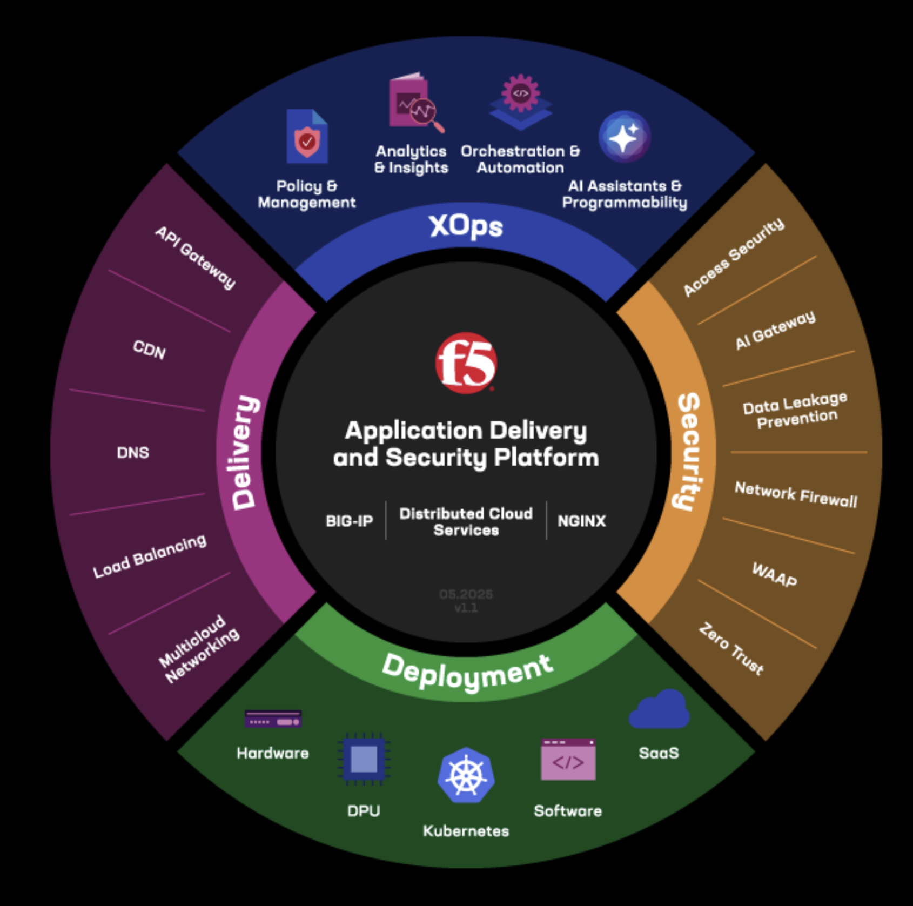

<h1 align="center">F5</h1>

<a href="https://www.f5.com/"></img></a>

## Description:
**Simplify Modern App Delivery and Security with NGINX One** from [F5](https://event.on24.com/wcc/r/5052107/B33DA7B950D5DFE6E289BACBE55AA3DA?mode=login&email=nelson@oakhalo.com&mkt_tok=NjUzLVNNQy03ODMAAAGdG6TdbeTdqCi4q_XSxvNvSvT5LW-EvjEvQa03ujfJgDY8juwT5YSAVi5HB6hqfgLXmGlnLeAbSSsK6NAnGkZhRQP1RNqd2TSL00VyM7J_WG59viYN8bU). In this webinar, we’ll show you how NGINX One empowers platform and DevOps teams to optimize modern application delivery. You'll also discover how its integrated components and centralized management enhance scalability, performance, and operational efficiency.

## Notes:
#### Matt Kaplan | [F5 NGINX](https://www.linkedin.com/in/matthew-kaplan-0658a619/)
- Demand Generation Marketing Manager: Driving Growth Through Strategic Digital Marketing & Content Leadership

#### Ella Jimenez | [F5 NGINX](https://www.linkedin.com/in/ellajimenez2700/)
- Business Developer Inbound: As a Business Developer at F5, I get to roll up my sleeves and dive into the exciting crossroads of technology, strategy, and growth. Think of me as your matchmaker for cutting-edge app and API solutions when you need them most! 

#### Jordan Gardner | [F5 NGINX](link)
- Product Marketing Manager: As a Business Developer at F5, I get to roll up my sleeves and dive into the exciting crossroads of technology, strategy, and growth. Think of me as your matchmaker for cutting-edge app and API solutions when you need them most! 
- Key Enablers driving faster time to market; proactive mitigation, fleet-wide visibility, configutation management, certificate management
- High Availability, Programmability, Observability, Security with digital experiences
- **NGINX Gateway Fabric** (NGF) Architecture Overview and [github](https://github.com/kubernetes-sigs/ingress2gateway)

#### Jason Clopper | [F5](https://www.linkedin.com/in/jasonclopper/)
- Senior Product Manager; Generation information from the speaker here. Product Manager for a PlatformOps, DevOps and DevSecOps focused SaaS based management and observability service, the NGINX One Console, from conception through launch and beyond.
- **Managing NGINX** instances [About](https://docs.nginx.com/nginx-instance-manager/#:~:text=About,which%20includes%20NGINX%20One%20components.)

## Resources:
- F5 is focusing on Security with NGINX One:
    - **F5 NGINX One** Application delivery management software to optimize, scale, and secure modern apps, Kubernetes clusters, API communications, and AI inference across diverse [environments](https://www.f5.com/products/nginx/one).
    - **NGINX ONE** Application Delivery Management Software Solutions [Overview](https://www.f5.com/pdf/solution-overview/f5-nginx-one-solution-overview.pdf)
    - **Slide Deck** for Simply Modern App Delivery and Security with NGINX [One](https://on24static.akamaized.net/event/50/52/10/7/rt/1/documents/resourceList1758648250956/simplifymodernappdeliveryandsecuritywithnginxone1758648250956.pdf)
    - F5 NGINX Product [Documentation](https://docs.nginx.com/)
    - [Event Calendars](https://www.f5.com/company/events) including Partner Connect Tech Academy

## Contact:
<!--- You can add in your linkedin, medium, stack overflow, dev.to account, etc. here --->
If you want to contact me you can reach me at <nelson@oakhalo.com>.

Connect with me on <a href="https://www.linkedin.com/in/ayla-nelson/">LinkedIn</a>

Connect with me on <a href="https://github.com/oakHalo">Oakhalo.dev</a>

<!-- 
### TODO stx: 
Future Structure (stx):
backend
frontend
images
screenShots [contains video link]
troubleShooting [contains issues resolved]
-->
